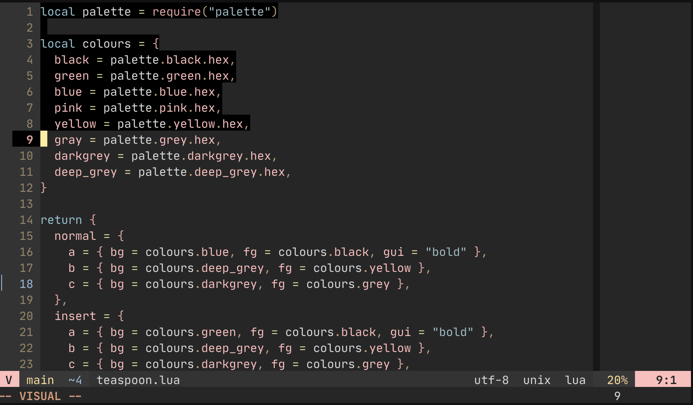

# Teaspoon

A [Lush] Theme for Neovim derived from the dark [Seoul256] theme for Vim.

This theme also dependds on [lualine] for customising the statusline.





## Install

Assuming you use [paq], otherwise adapt to your preferred package manager.

```lua
pac {
  "savq/paq-nvim",

  "nvim-lualine/lualine.nvim",
  "rktjmp/lush.nvim",
  "arnau/teaspoon.nvim",
}

```


## Licence

Arnau Siches under the MIT License. See [LICENCE] and [COPYING].


[Lush]: http://git.io/lush.nvim
[Seoul256]: https://github.com/junegunn/seoul256.vim
[lualine]: https://github.com/nvim-lualine/lualine.nvim
[paq]: https://github.com/savq/paq-nvim/
[LICENCE]: ./LICENCE
[COPYING]: ./COPYING
